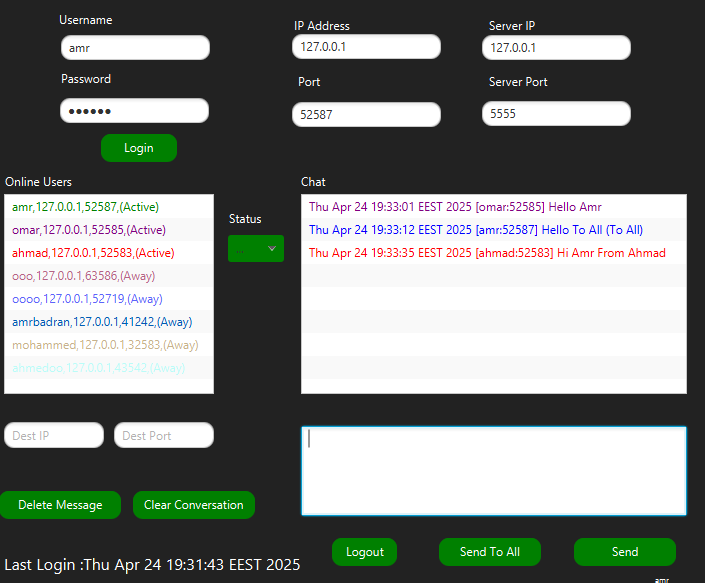
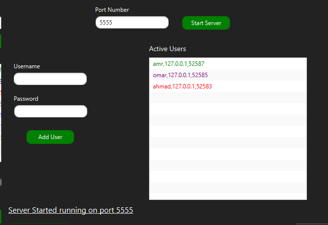

> **Note:** Part 1 Peer-to-Peer is on branch p2p of this repo

# 🌐 Java P2P Chat Application with TCP Registration Server (Part 2)
This is an enhanced version of the Peer-to-Peer Chat Application built in Java. In addition to direct UDP/TCP-based chatting between clients, this version introduces a TCP Server that manages client registration, authentication, and presence tracking — similar to how Skype or other messaging platforms work.

## ⚙️ Overview
- Clients login via TCP to a central server using their username and password.

- The server maintains a list of active clients and shares it with all connected clients.

- Actual messaging is still peer-to-peer, over UDP.

- Clients can see the list of online users, their status (Active, Away, Busy), and last login time.

- Messages are color-coded per user and displayed with timestamps.

- Supports status management and automatic idle detection.

## 🚀 Features
### ✅ Client Side
- Login system with username/password authentication (case-insensitive).

- Display list of online users with their Current status (Active, Busy, Away)

- 💬 Peer-to-peer chat with UDP.

- 📢 Send to all option to broadcast message to all online peers.

- 📘 Custom colors for each user in the chat.

- 🔘 Set your own status (Active, Busy, Away).

- 🕒 Automatic Away status if user is inactive for 30+ seconds.

- 👂 Revert status to Active on any mouse activity.

- 🔐 Logout button to safely exit the session.

## ✅ TCP Server Side
- 📜 Maintains list of online clients and broadcasts it to all connected peers.

- 🧾 User credentials stored in file with the format:

Username  Password
Ali       1234
Saly      A20B
Aws       ABcd
Adam      1Cb2

- ➕ Add new users from the server GUI (duplicate usernames not allowed).

- 👀 Display all currently logged-in users in real-time.

- 🔐 Case-insensitive login validation.

## GUI Preview

