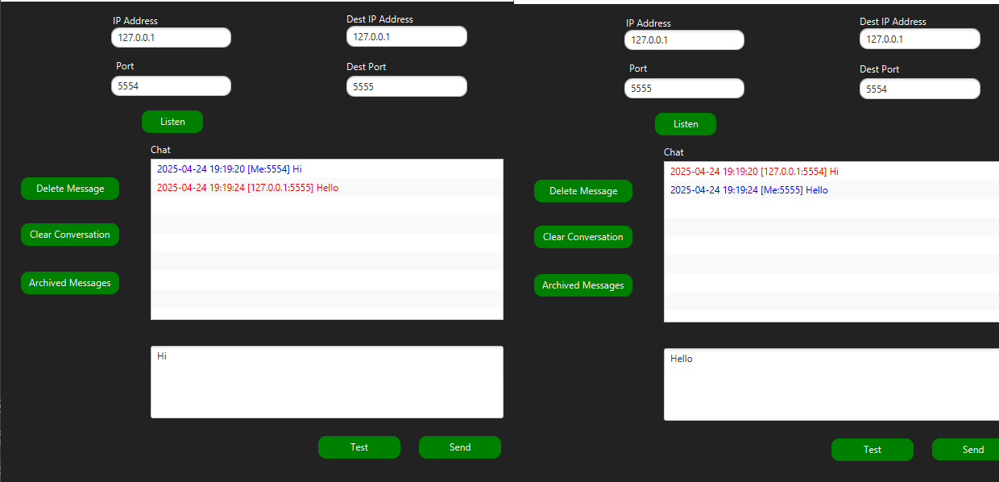

# Java Peer-to-Peer Chat Application
This is a Peer-to-Peer Chat Application developed in Java with a user-friendly Graphical User Interface (GUI) using UDP and TCP Socket Programming. The app allows two users to communicate directly over a network without a central server.

## 🚀 Features
### 📡 P2P Chat using both UDP and TCP sockets.
### 🖥️ GUI with:

- Input fields for source and destination IPs & ports.

- Text areas for chat display and message input.

- Functional buttons for chat management.

###🕒 Timestamp on all messages (sent & received).

### 🎨 Color-coded messages:

- 🔵 Sent messages (Blue)

- 🔴 Received messages (Red)

### 🧹 Delete Options:

- Delete selected message.

### 📂 Archive System:

- Archived messages stored in a separate tab/window.

- Deleted messages moved to archive before auto-removal (after 2 minutes).

- Messages in archive can be restored by user.

### 📜 Logging:

All user actions are logged in a log file (activity.log).

🛠️ Technologies Used
- Java FX for GUI

- UDP Socket Programming

- TCP Socket Programming

- File I/O for logging

- Multithreading (Each Client has TCP Thread Server running)

## 📸 GUI Preview

